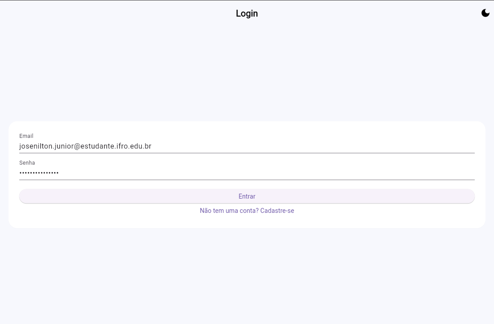
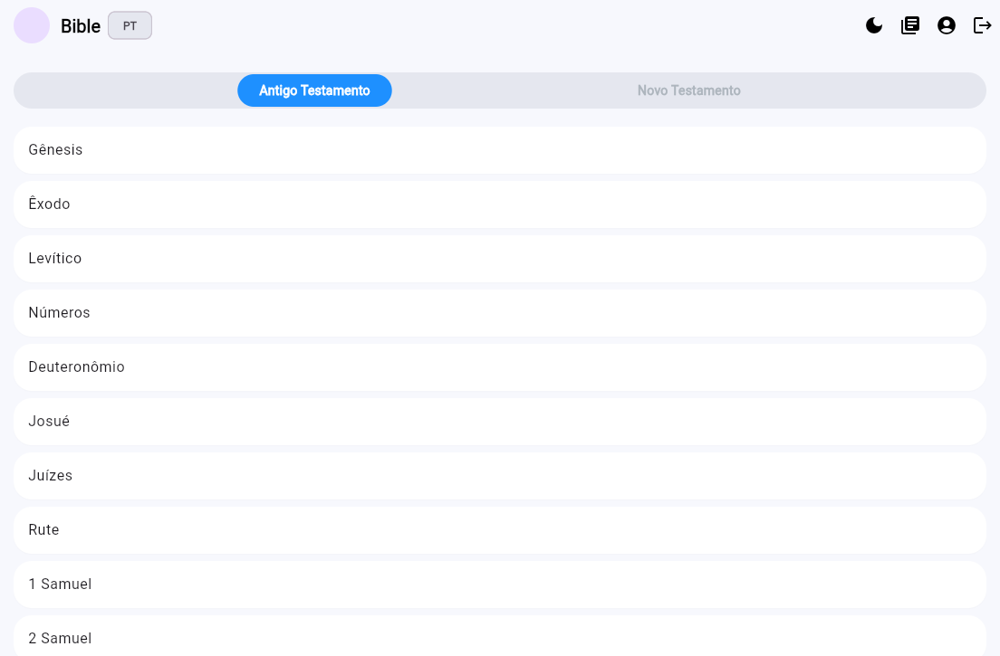
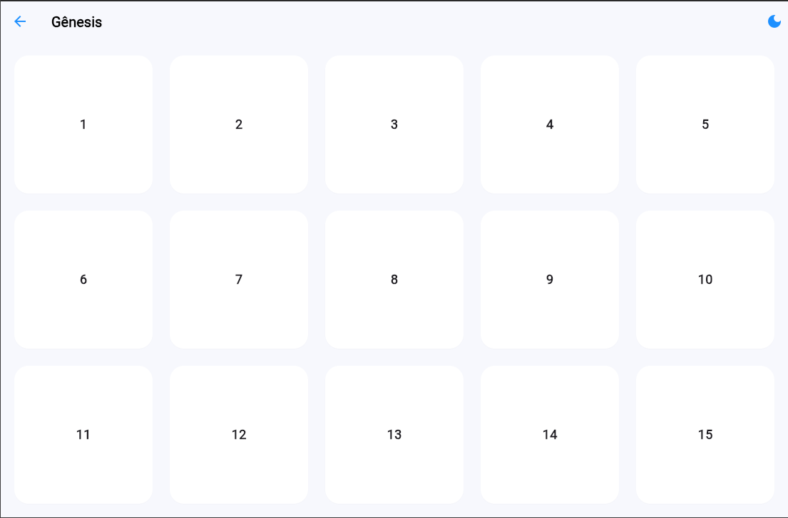
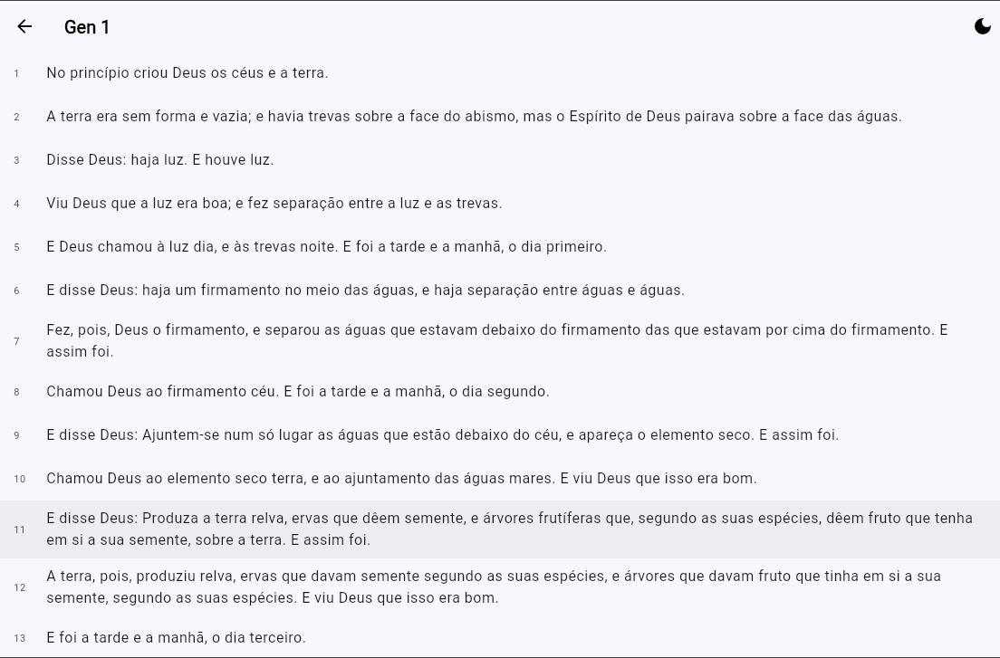
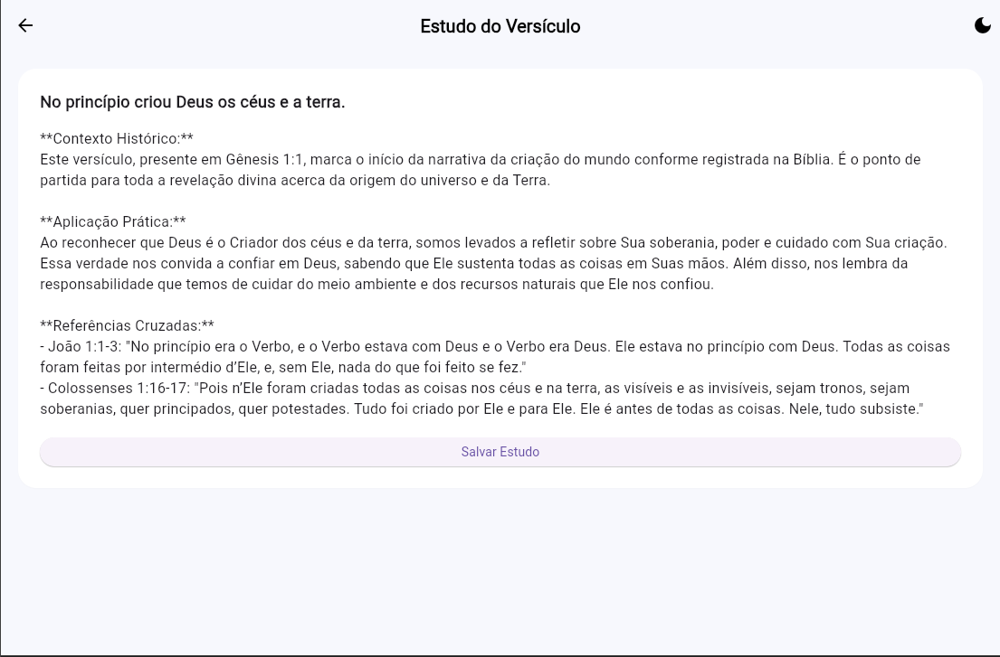
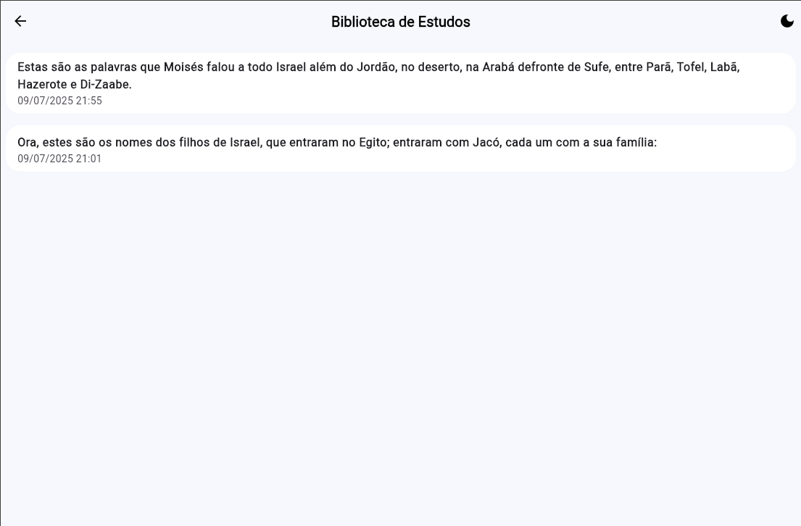
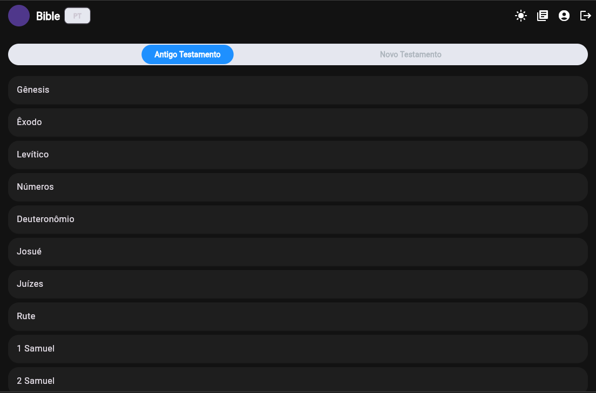

# 📖 Bible Study Diary + IA

Um aplicativo Flutter que funciona como **diário de estudos bíblicos**. Ele permite ao usuário navegar pelos livros, capítulos e versículos da Bíblia, tocar em um versículo e receber automaticamente um **estudo aprofundado gerado por IA** (OpenAI). Todos os estudos podem ser salvos no **Firebase** (Authentication + Cloud Firestore) e revistos depois em uma biblioteca pessoal. O app também usa **WebView** para abrir artigos externos quando sugeridos pela IA.

---

## 🔧 Tecnologias Utilizadas

| Tecnologia                  | Papel no Projeto                                        |
| --------------------------- | ------------------------------------------------------- |
| **Flutter & Dart**          | UI nativa multiplataforma                               |
| **Firebase Authentication** | Login e criação de conta via e‑mail/senha               |
| **Cloud Firestore**         | Banco de dados em tempo real para estudos salvos        |
| **Bible4U API**             | Fornece livros, capítulos e versículos da Bíblia        |
| **OpenAI API**              | Gera estudo avançado (Contexto, Aplicação, Referências) |
| **flutter\_dotenv (.env)**  | Armazena chaves de API com segurança                    |

---

## 🚀 Funcionalidades

* 📚 **Navegação Bíblica** – lista livros, capítulos e versículos em PT‑BR.
* 🧠 **Gerar Estudo Avançado** – IA cria Contexto Histórico, Aplicação Prática e Referências Cruzadas em até 500 tokens.
* 💾 **Salvar Estudo** – armazena estudo no Firestore com data e versículo.
* 📖 **Biblioteca de Estudos** – visualiza, abre e gerencia estudos salvos.
* 🔐 **Autenticação segura** – login/cadastro com validação de senha.
* ☁️ **Sincronização em tempo real** – dados atualizados automaticamente.

---

## ⚙️ Configuração do Projeto

```bash
# 1. Clone o repositório
git clone https://github.com/JJpaxeco/atividadefinal-bible.git
cd atividadefinal-bible

# 2. Instale as dependências
flutter pub get
```

3. Crie um arquivo **`.env`** na raiz com suas chaves (exemplo):

```env
OPENAI_API_KEY=sua-chave-aqui
```

4. **Importante:** adicione `.env` ao **`.gitignore`** para não vazar credenciais.

---

## 📂 Estrutura de Diretórios

```text
lib/
├── models/                  # Modelos de dados (Bíblia, livro, versículo)
│   ├── bible_model.dart
│   ├── book_model.dart
│   ├── language_model.dart
│   ├── study_model.dart
│   └── verse_model.dart
├── pages/                   # Telas principais
│   ├── account_page.dart    # Perfil/conta do usuário
│   ├── chapters_page.dart   # Lista capítulos
│   ├── home_page.dart       # Tela inicial
│   ├── library_page.dart    # Biblioteca de estudos
│   ├── login_page.dart      # Login
│   ├── signup_page.dart     # Cadastro
│   ├── study_page.dart      # Exibe estudo da IA
│   ├── verses_page.dart     # Lista versículos
│   └── webview_page.dart    # Abre artigo externo
├── services/                # Lógica de negócio / integrações
│   ├── auth_service.dart
│   ├── bible_api_service.dart
│   ├── firestore_service.dart
│   └── openai_service.dart
├── utils/                   # Funções auxiliares
│   └── utils.dart
├── widgets/                 # Widgets reutilizáveis / tema
│   ├── segmentation_tabs.dart
│   ├── app_state.dart
│   ├── firebase_options.dart
│   ├── main.dart            # Entry point
│   └── theme.dart
├── screenshots/             # Imagens usadas no README
└── test/                    # Testes unitários/widget
    ├── language_dropdown_test.dart
    └── widget_test.dart

web/                          # Build Flutter Web
.env                           # ← variáveis (não versionar!)
.gitignore                     # Arquivos ignorados
analysis_options.yaml          # Regras de lint
firebase.json                  # Config Firebase local
firestore.rules                # Regras de segurança
pubspec.yaml                   # Dependências e assets
README.md
```

---

## 📱 Imagens do App (Screenshots)










