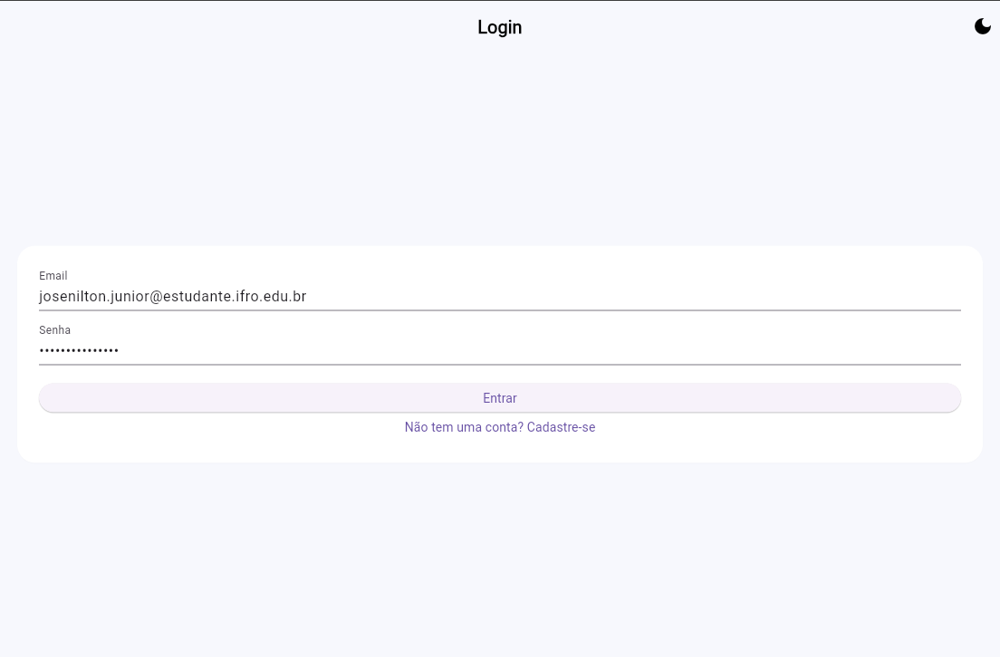
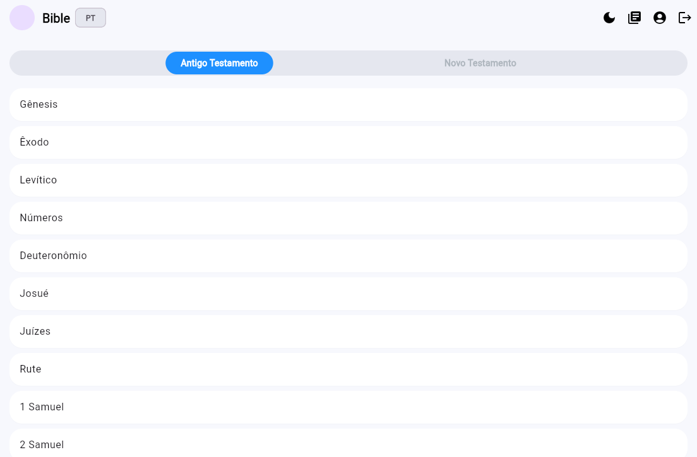
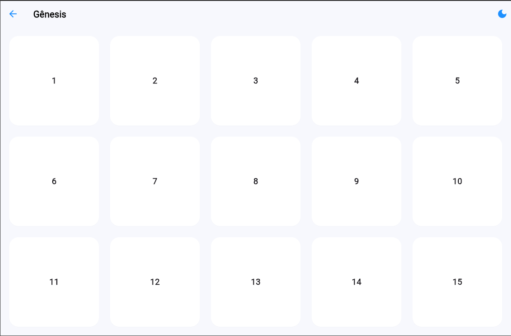
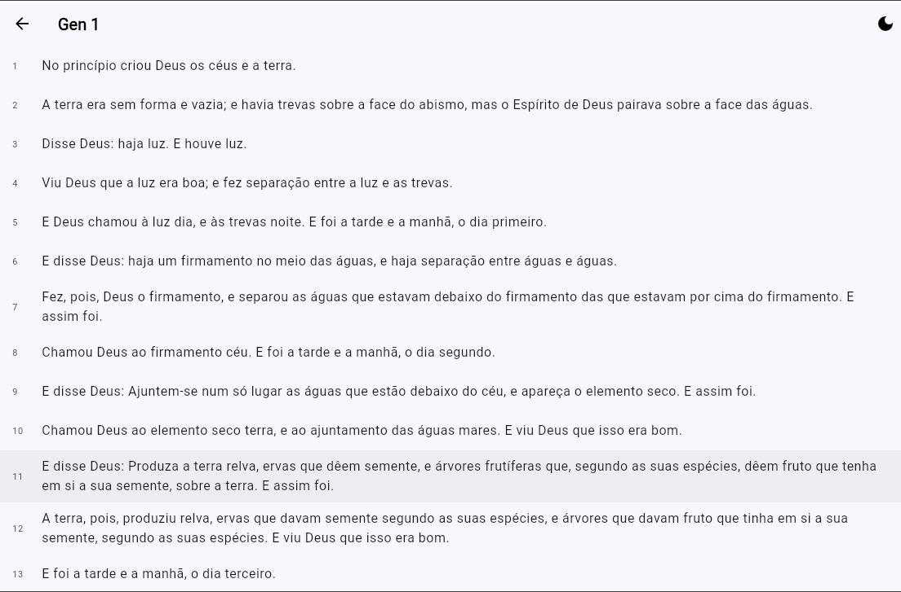
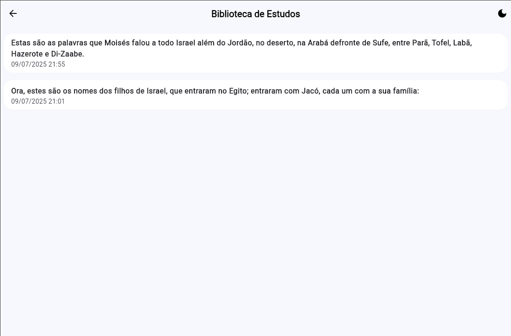
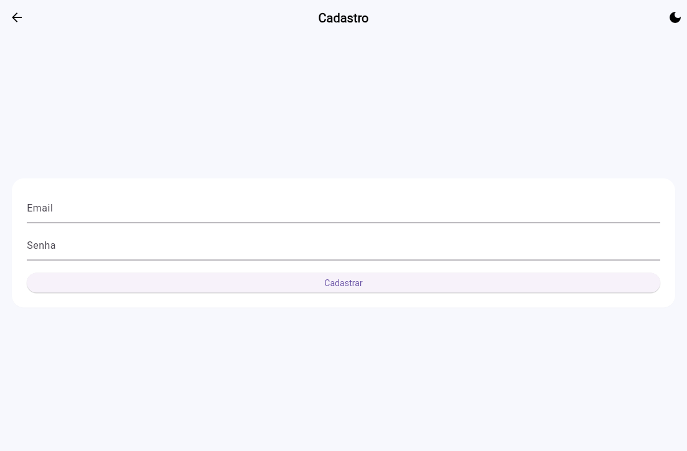
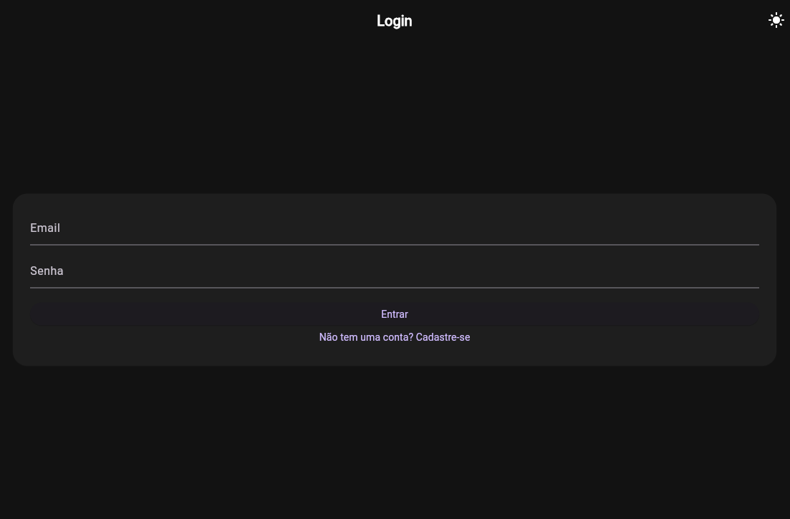
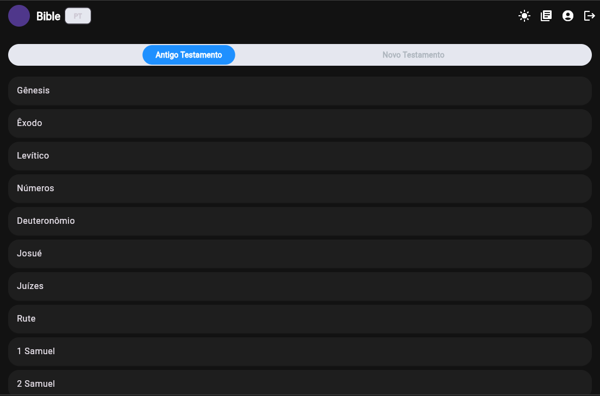

# Diário de Estudos Bíblicos + IA

Um aplicativo Flutter completo que permite aos usuários navegar pela Bíblia em múltiplos idiomas, selecionar versículos, gerar estudos aprofundados com a ajuda da IA da OpenAI, e salvar esses estudos em uma biblioteca pessoal.

## Funcionalidades Principais

*   **Navegação Bíblica Completa**: Explore livros, capítulos e versículos.
*   **Seleção de Idioma**: Alterne entre diferentes traduções da Bíblia.
*   **Geração de Estudos com IA**: Obtenha análises detalhadas de versículos, incluindo contexto histórico, aplicação prática e referências cruzadas, geradas pela API da OpenAI.
*   **Biblioteca Pessoal**: Salve, visualize e remova seus estudos bíblicos.
*   **Autenticação Segura**: Cadastro e login com e-mail e senha, utilizando Firebase Authentication.
*   **Gerenciamento de Conta**: Altere e-mail e senha com segurança.
*   **Modo Claro e Escuro**: Interface adaptável para diferentes ambientes de iluminação.
*   **Design Moderno**: Interface limpa e responsiva.

---

## Passo a Passo para Montar o Projeto

### 1. Pré-requisitos

Antes de começar, certifique-se de ter o seguinte instalado em sua máquina:

*   [Flutter SDK](https://flutter.dev/docs/get-started/install) (versão 3.x ou superior)
*   Um editor de código, como [VS Code](https://code.visualstudio.com/) ou [Android Studio](https://developer.android.com/studio)
*   [Git](https://git-scm.com/downloads) para controle de versão

### 2. Clonando o Repositório

Primeiro, clone o repositório do GitHub para o seu ambiente local:

```bash
git clone https://github.com/JJpaxeco/atividadefinal-bible.git
cd atividadefinal-bible
```

### 3. Configuração do Firebase

Este projeto utiliza o Firebase para autenticação e armazenamento de dados.

1.  **Crie um Projeto Firebase**:
    *   Acesse o [Console do Firebase](https://console.firebase.google.com/).
    *   Clique em "Adicionar projeto" e siga as instruções para criar um novo projeto.

2.  **Configure o FlutterFire**:
    *   Instale a CLI do Firebase (`firebase-tools`) e a CLI do FlutterFire (`flutterfire_cli`) globalmente se ainda não as tiver.
    *   Execute `flutterfire configure` na raiz do seu projeto Flutter para conectar seu app ao projeto Firebase.

3.  **Habilite os Serviços**:
    *   No Console do Firebase, vá para a seção **Authentication** e habilite o provedor de "E-mail/senha".
    *   Vá para a seção **Firestore Database**, crie um banco de dados e inicie no **modo de teste**.

4.  **Regras de Segurança do Firestore**:
    *   Ainda no Firestore, vá para a aba "Regras".
    *   Copie o conteúdo do arquivo `firestore.rules` (na raiz do projeto) e cole no editor de regras. Publique as alterações.

### 4. Configuração da API da OpenAI

O aplicativo usa a API da OpenAI para gerar os estudos bíblicos.

1.  **Obtenha uma Chave de API**:
    *   Acesse a [plataforma da OpenAI](https://platform.openai.com/api-keys).
    *   Crie uma nova chave de API secreta.

2.  **Crie o Arquivo `.env`**:
    *   Na raiz do seu projeto, crie um arquivo chamado `.env`.
    *   Dentro deste arquivo, adicione sua chave de API no seguinte formato:
      ```
      OPENAI_API_KEY=SUA_CHAVE_SECRETA_DA_OPENAI_AQUI
      ```
    *   **Importante**: O arquivo `.env` está no `.gitignore` e não deve ser enviado para o repositório.

### 5. Instalação das Dependências

Com as configurações feitas, instale todas as dependências do projeto com o seguinte comando:

```bash
flutter pub get
```

### 6. Executando o Aplicativo

Agora você está pronto para executar o projeto!

*   **Para Android:**
    ```bash
    flutter run
    ```
    *(Requer Android API >= 23)*

*   **Para iOS:**
    ```bash
    flutter run
    ```

---

## Estrutura do Projeto

O projeto segue uma arquitetura limpa, separando as responsabilidades em diferentes camadas:

-   `lib/models`: Contém os modelos de dados (DTOs) para representar as entidades da aplicação (Bíblia, Livro, Versículo, Estudo, etc.).
-   `lib/pages`: Contém as telas (widgets de página inteira) da interface do usuário.
-   `lib/services`: Contém a lógica de negócios e a comunicação com serviços externos (Firebase, APIs).
-   `lib/widgets`: Contém widgets reutilizáveis usados em várias partes da UI.
-   `lib/theme.dart`: Define o tema visual global do aplicativo.
-   `lib/app_state.dart`: Gerencia o estado global da aplicação, como o tema e o idioma.


## Prints do Fluxo do projeto








